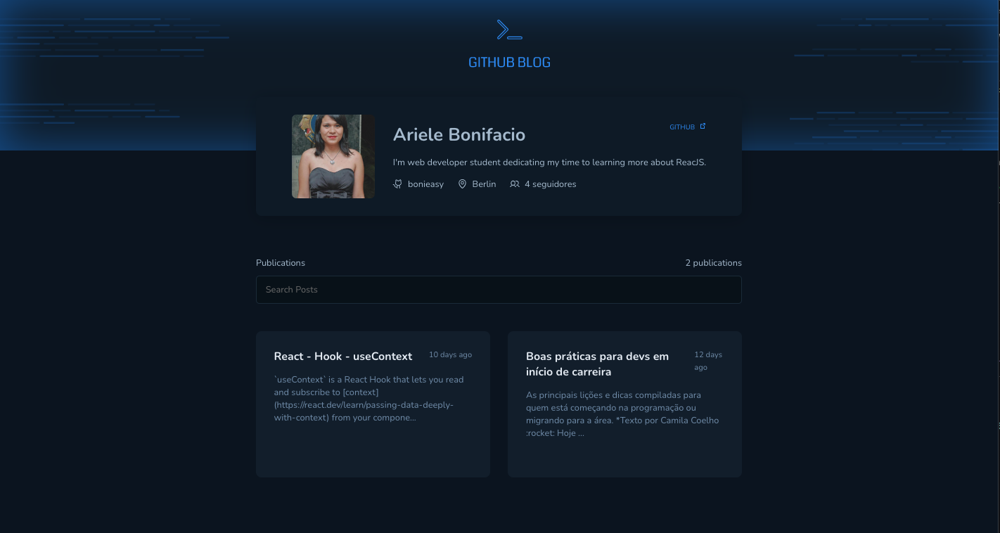

  <h1>Github Blog - A Challenge from <a href="https://lp.rocketseat.com.br/ignite" target="_blank"> Rocketseat </a> :rocket: </h1>

The challenge was to create a blog using the Github API, where the repository issues would be the posts.

  
Click <a href="https://bonieasy.github.io/github_blog/" target="_blank"> here </a> to access

## Tech Stack

ReactJS | Typescript | styled-components | Vite | Axios | React Router DOM | React Hook Form 

Made with :heart: by <a href="https://www.linkedin.com/in/ariele-bonifacio/" target="_blank">Ariele Bonifacio (Boni) </a>

